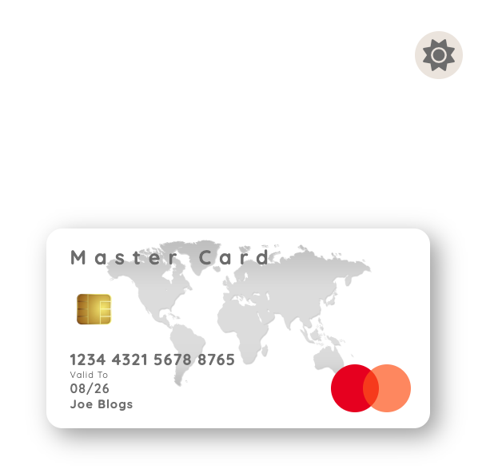
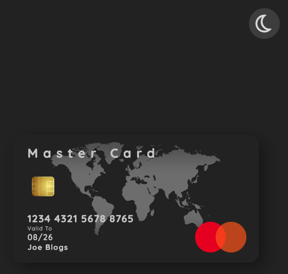

# Dark Mode Project

## 1. Project Description: 

A web page containing a credit card and a toggle button.

By toggling a button on the web page which is rendered in a web browser, users can change the mode from dark to light and vice versa.


## 2. Tech Stack: 

- HTML
- CSS
- Javascript

## 3. Installing:

1. Clone the repo

```
https://github.com/AAdewunmi/Project_Dark_Mode.git
```

2. Open Project Folder

3. Explore

4. Open index.html in Visual Studio Code, using Live Server.

5. Click on toggle button to experience a transition between light and dark mode.

Enjoy :)

## 4. Screenshots:

- Light Mode




- Dark Mode



# Adapted from:

UDEMY Course: 50+ Web Projects with HTML, CSS, and JavaScript.

Project Name: Project 4: Dark Mode

Created by: Created by Code And Create, George Lomidze, Lasha Nozadze

Last updated 07/2022

URL: https://www.udemy.com/course/50-web-projects-with-html-css-and-javascript/
